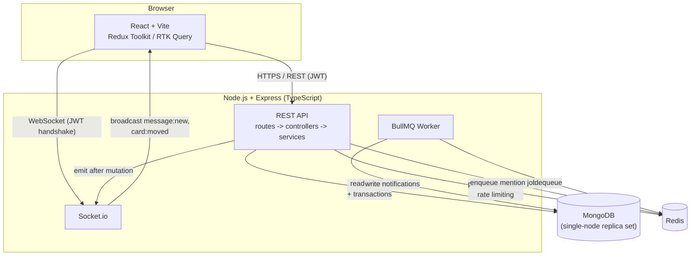
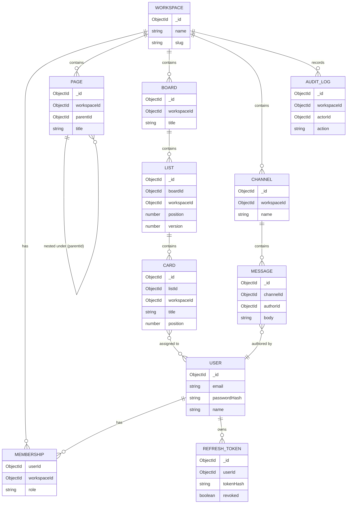

# Huddle

A Mini SaaS inspired by **Notion** (Pages), **Trello** (Boards) and **Slack**
(Channels) — one workspace app, one auth/RBAC layer, one realtime and search
layer across all three, built for a Senior Full Stack Developer / Team Lead
assessment.

**Repo:** the source of truth for everything below. **Spec:**
[`docs/superpowers/specs/2026-09-24-huddle-saas-design.md`](docs/superpowers/specs/2026-09-24-huddle-saas-design.md)
— the original design, tiered scope decision, and an honest post-review
correction of what's actually built vs. planned. **Plans + execution
ledgers:** [`docs/superpowers/plans/`](docs/superpowers/plans/) — every task,
every deliberate deviation from the plan, and both independent code reviews
that were run against this codebase (which found and fixed 6 Critical
backend bugs and 4 Critical frontend bugs — see below).

## Quick start

```bash
git clone https://github.com/SachinThakur1124/huddle-saas.git
cd huddle-saas
docker compose up --build
```

- Frontend: http://localhost:5173
- Backend: http://localhost:4000 (Swagger UI at `/api/docs`)
- Mongo is started as a single-node replica set and initiated automatically
  by the `mongo-init` one-shot service — **this is required**, not optional:
  card/page/role-change transactions fail against a plain standalone
  `mongod` (see the Known Limitations / execution ledger for how this was
  discovered).

To run either app outside Docker for local development, see
[`backend/README.md`](backend/README.md) and
[`frontend/README.md`](frontend/README.md).

## Features

| Domain | What's real |
|---|---|
| Auth | JWT access tokens (15 min) + rotating refresh tokens with reuse detection (replaying a used token revokes the whole token family) |
| RBAC | Workspace roles (owner/admin/member/viewer), Redis-cached, with a rank ceiling on role changes and last-owner protection |
| Pages | Nested docs, cascade delete (cycle-safe), full CRUD |
| Boards | Board → List → Card, drag-and-drop reorder across lists, dense position invariant maintained transactionally |
| Chat | Channels, cursor-paginated messages, Socket.io realtime (JWT-authenticated, membership-checked room joins) |
| Search | Cross-entity (Pages/Cards/Messages) text search, scoped to the workspace |
| Jobs | BullMQ: `@mention` notifications are real and workspace-scoped; `search-reindex` exists and is tested but isn't wired to anything (Mongo text indexes update on write, so there's no real reindex work — see Known Limitations) |
| Frontend | React + Vite + TS, Redux Toolkit + RTK Query (optimistic updates, 401-triggered reauth), React Hook Form + Zod, `@dnd-kit`, dark mode, route-level error boundaries, a minimal offline queue for chat |
| DevOps | Docker + docker-compose (one-command local run), GitHub Actions CI (lint → typecheck → test-with-coverage-gate → build → docker build) |

## Architecture



## ER diagram



(The full design rationale for every entity and relationship is in the
spec, §3.)

## API documentation

Swagger UI at `/api/docs` once the backend is running. Only `POST
/auth/register` currently has a full `@openapi` annotation as the
documented pattern — see Known Limitations.

## Testing

- Backend: `cd backend && npm test` (73 tests) / `npm run test:coverage`
  (60%+ statement/branch gate on `src/services/**` and
  `src/middleware/**`, currently ~91%)
- Frontend: `cd frontend && npm test` (7 tests — intentionally lighter,
  see the frontend plan's scope decision)
- CI runs both, plus lint, typecheck, and a Docker build, on every push/PR
  to `main`.

## Engineering process (why this looks the way it does)

This was built the way a Team Lead should build under a same-day
deadline: scope explicitly, build with tests, get it reviewed, fix what
the review finds, and write down what's genuinely done vs. cut — not
just build fast and hope. Concretely:

1. **Spec first.** [`docs/superpowers/specs/2026-09-24-huddle-saas-design.md`](docs/superpowers/specs/2026-09-24-huddle-saas-design.md)
   explicitly tiers scope (Tier 1 = fully real and tested, Tier 3 =
   deliberately minimal) rather than promising equal depth on all 35-40
   possible endpoints.
2. **Plans with real TDD.** [`docs/superpowers/plans/`](docs/superpowers/plans/)
   — the backend plan is exhaustive (every task's tests specified before
   the code); the frontend plan is deliberately lighter given the
   timeline, and says so.
3. **Independent code review, twice.** A fresh review (not self-review)
   was run against the backend and again against the frontend. Both
   found real, reproduced-not-guessed bugs:
   - **Backend:** an unhandled-promise-rejection crash on any malformed
     request, a cross-workspace IDOR (a member of one workspace could
     read/write another's data), an unauthenticated Socket.io room join,
     an admin-to-owner privilege escalation path, non-deterministic card
     ordering, and an infinite loop from a page being set as its own
     parent. All fixed, all covered by a new attack-shaped test.
   - **Frontend:** a socket reconnect loop that broke realtime entirely,
     a session that didn't survive a page reload (plus a React
     StrictMode race that could revoke a refresh-token family), the app
     silently breaking 15 minutes after login with no token refresh, and
     drag-and-drop math that sent the wrong value to a backend whose
     positions weren't actually kept dense. All fixed.
4. **The execution ledgers are the real changelog.** Every deliberate
   deviation from a plan — a dependency bump for a CVE, a test that was
   itself wrong, a scope cut — is recorded with a reason and a cost-if-
   wrong, not silently done.

## Known limitations

See the spec's §9 for the full, itemized list (endpoint count vs. the
original 35-40 target, which BullMQ job is real, Swagger coverage,
offline support scope, the refresh-token-in-body decision and why). The
short version: everything Tier 1 in the spec is real, tested, and was
independently reviewed twice; anything cut for time is named explicitly
rather than silently missing.

## Deliverables checklist

| Assignment ask | Where |
|---|---|
| Source code | this repo |
| README | this file, plus `backend/README.md` and `frontend/README.md` |
| Architecture diagram | above |
| ER diagram | above |
| API documentation | Swagger UI at `/api/docs` |
| Docker setup | `docker-compose.yml`, `backend/Dockerfile`, `frontend/Dockerfile` |
| Git history (40+ meaningful commits) | `git log --oneline` on `main` |
