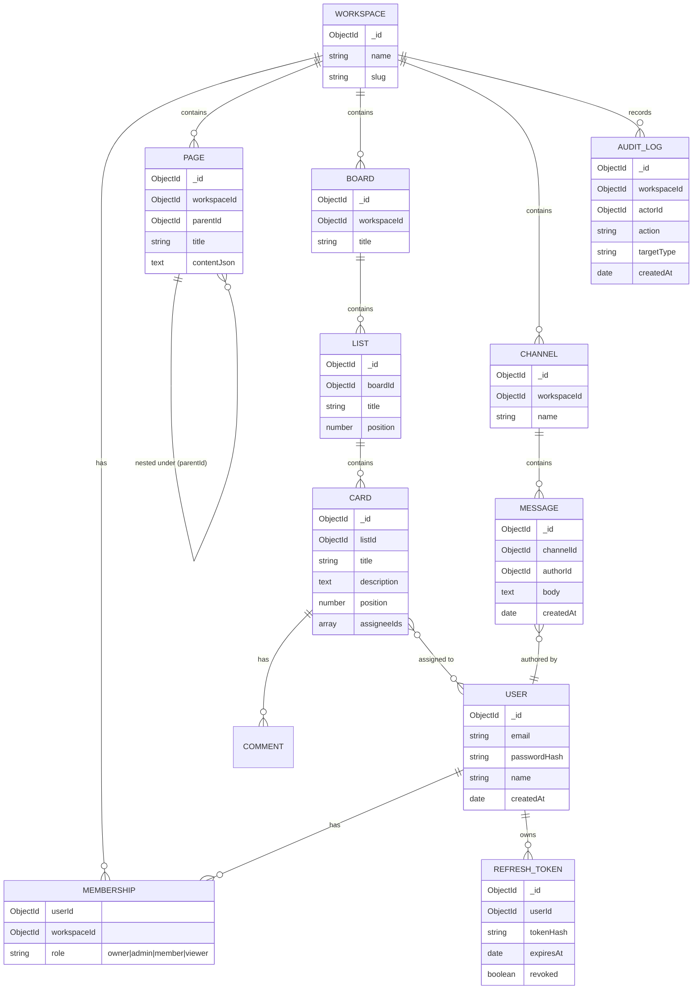

# Huddle — Mini SaaS (Notion + Trello + Slack) — Design Spec

**Date:** 2026-09-24
**Context:** Senior Full Stack Developer / Team Lead take-home assessment.
**Constraint:** Single-day build. See "Tiered scope" — this drives every trade-off below.
**Status:** Approved by user (conversational design review, 2026-09-24).

## 1. Goal

Build one coherent multi-tenant workspace SaaS — not three disconnected demo apps —
that lets a Workspace contain:
- **Pages** (Notion-style nested documents)
- **Boards** (Trello-style lists/cards with drag & drop)
- **Channels** (Slack-style realtime chat)

sharing one auth/RBAC layer, one audit log, one search index, and one activity feed.
This is more architecturally defensible for evaluation (System Design, Architecture)
than three bolted-together toy apps, and gives a single, explainable data model for
live debugging.

## 2. Tiered scope (explicit, documented trade-off)

Full production depth on every bullet in the assignment PDF in one day is not
achievable at senior quality. Rather than spreading effort thin across all of it,
scope is tiered and this tiering is called out in the README as a deliberate
engineering decision:

- **Tier 1 — fully real, tested:** auth + refresh token rotation, workspace RBAC,
  CRUD across Pages/Boards/Channels, Mongo transactions + aggregations, Socket.io
  realtime chat + live card moves, Redis permission cache, 2 real BullMQ jobs
  (mention-notification fan-out, search reindex), audit log, cross-entity search,
  Swagger docs, Docker + CI pipeline with coverage gate.
- **Tier 2 — working, lighter polish:** drag & drop reordering, infinite scroll,
  optimistic UI via RTK Query, dark mode, route-level error boundaries.
- **Tier 3 — basic, explicitly scoped down:** offline support (cached app shell +
  queued outbound actions, not full offline-first sync), file uploads (local disk
  volume, not S3), live deploy (free-tier caveats: cold starts, ephemeral disk).

## 3. Domain model / ER overview

## 4. Backend architecture

- **Stack:** Node.js + Express + TypeScript, Mongoose (MongoDB), Redis (ioredis),
  BullMQ, Socket.io, Zod validation, Argon2 password hashing.
- **Layering:** `routes -> controllers -> services -> models`. Services hold business
  logic and are the unit tested for coverage; controllers stay thin (parse/respond).
- **Auth:** access JWT (15 min, in memory on client) + refresh token (httpOnly
  cookie, opaque random token hashed at rest, rotated on every use, reuse of a
  revoked token invalidates the whole token family — standard rotation-with-reuse-
  detection pattern).
- **RBAC:** role stored per (user, workspace) in `Membership`. Middleware resolves
  `req.membership` once per request (cached in Redis, keyed
  `membership:{userId}:{workspaceId}`, invalidated on role change) and route
  handlers declare a minimum role.
- **Transactions:** used where a single logical action spans documents that must
  stay consistent — e.g. moving a card (position update + audit log entry), role
  changes (membership update + audit log).
- **Aggregations:** workspace activity feed (merge recent pages/cards/messages by
  `createdAt`), board stats (card counts per list), search relevance ranking.
- **Redis:** permission cache (above) + login rate limiting
  (`rate-limit-redis` + `express-rate-limit`).
- **BullMQ:** `mention-notification` queue (fired when a page/card/message body
  references `@user`) and `search-reindex` queue (debounced reindex after bulk
  edits). Both have a real worker process, not a stub — this is the two jobs the
  one-day budget can support at real quality.
- **Socket.io:** namespaced per workspace room; events for `message:new`,
  `card:moved`, `presence:update`. REST is the source of truth; sockets broadcast
  the resulting state so optimistic client updates reconcile against a real event.
- **File uploads:** Multer to a local `uploads/` volume (mounted in Docker), size-
  and mimetype-limited; storage is an injectable interface so swapping in S3 later
  is a config change, not a rewrite (documented, not built, given the timeline).
- **Search:** MongoDB text indexes on Page.title/content, Card.title/description,
  Message.body; one `/search?q=` endpoint fans out to all three and merges/ranks
  server-side.
- **Audit log:** a small `audit(actorId, workspaceId, action, targetType, targetId)`
  helper called from services after any create/update/delete/role-change; queryable
  via a workspace settings endpoint.
- **Docs:** swagger-jsdoc annotations on every route, served at `/api/docs`.
- **Security:** Helmet, CORS allowlist, Zod input validation on every mutating
  route, Mongo injection sanitization, no secrets in source (dotenv + `.env.example`).

## 5. Frontend architecture

- **Stack:** React + Vite + TypeScript, Redux Toolkit + RTK Query (chosen over
  Zustand because RTK Query's cache + optimistic-update primitives cover both the
  "Redux Toolkit or Zustand" and "Optimistic UI" requirements with one dependency),
  React Hook Form + Zod resolvers, `@dnd-kit` for board drag & drop.
- **Structure:** feature-folder layout (`features/auth`, `features/pages`,
  `features/boards`, `features/chat`) each owning its RTK Query API slice,
  components, and route(s).
- **Optimistic UI:** RTK Query `onQueryStarted` optimistic cache patches for card
  moves and message sends, rolled back on server error.
- **Infinite scroll:** reverse-cursor pagination on chat messages (IntersectionObserver
  sentinel at the top of the list).
- **Dark mode:** CSS custom properties + a persisted toggle (`localStorage`).
- **Error boundaries:** one per top-level route, with a retry action.
- **Offline (Tier 3):** Vite PWA plugin caches the app shell; outbound mutations
  made while offline queue in IndexedDB and flush on reconnect — intentionally not
  a full CRDT/conflict-resolution system.

## 6. Testing strategy

- Backend: Jest + Supertest + `mongodb-memory-server` (no external DB dependency
  in CI). Coverage focused on services (auth, RBAC, board mutations, message
  creation, audit logging) since that's where 60%+ coverage is meaningful rather
  than padded via trivial getters/DTOs.
- Frontend: Vitest + React Testing Library for core flows (login, create card, drag
  reorder, send message) plus reducer/slice unit tests.
- CI enforces a coverage floor and fails the build below it.

## 7. DevOps / CI-CD

- `Dockerfile` (multi-stage) for backend and frontend; `docker-compose.yml` wiring
  backend + frontend + mongo + redis for one-command local run — this satisfies the
  assignment's literal "Docker Setup" deliverable without requiring a live deploy
  to be gradeable.
- GitHub Actions pipeline: `lint → typecheck → test (coverage gate) → build →
  docker build`, running on push/PR to `main`.
- Live demo (stretch, Tier 3): MongoDB Atlas free tier + Upstash free Redis +
  Render (backend + frontend), wired via a deploy job gated on `main` passing CI.
  Documented caveats: cold starts, ephemeral local-disk uploads on free tier.

## 8. Deliverables mapping

| Assignment deliverable | Where it lives |
|---|---|
| Source code | this repo |
| README | `/README.md` — setup, features, architecture, tradeoffs |
| Architecture diagram | Mermaid in README |
| ER diagram | Mermaid, this doc §3, mirrored in README |
| API docs | Swagger UI at `/api/docs` + committed OpenAPI JSON |
| Docker setup | `Dockerfile`s + `docker-compose.yml` |
| Git history (40+ commits) | incremental, feature-by-feature commits through the build |

## 9. Known limitations (stated up front, not discovered by the evaluator)

*Updated 2026-09-24 after the backend's final code review — corrected to
match what's actually built rather than the original plan.*

- Endpoint count is ~25, not 35-40. Not every endpoint gets exhaustive
  filtering/pagination — breadth across the three domains is prioritized
  over exhaustive depth in any one.
- Of the 2 planned BullMQ job types, `mention-notification` is fully real
  (enqueued on every message, scoped to actual workspace members). The
  `search-reindex` job exists and is unit-tested but is **not enqueued
  anywhere** — Mongo's text indexes update automatically on write, so
  there was no real reindex work to schedule; this job is a stub, not the
  "2 real jobs" originally claimed.
- Swagger/OpenAPI annotations exist on 1 of ~25 routes (`POST
  /auth/register`, as the documented pattern). `/api/docs` is not a
  complete API reference. Also note: `apis: ["src/routes/*.ts"]` reads
  TypeScript source at runtime, which won't resolve from a Docker image
  that ships only compiled `dist/` — the DevOps plan needs to either copy
  `src/routes` into the image or switch to a pre-generated OpenAPI JSON.
- The refresh token is returned in the JSON response body, not an
  httpOnly cookie (this backend's auth routes don't set one). The
  frontend therefore has no choice but to store it in `localStorage`,
  which is more exposed to XSS than a cookie would be. A same-day ruling,
  not an oversight — see the backend plan's execution ledger.
- Activity-feed aggregation (merging recent pages/cards/messages) and a
  route to read the audit log (the service exists, nothing calls it) were
  cut for time.
- `/uploads` is served statically with no auth check — anyone with a
  file's (randomly-named) URL can fetch it.
- Offline support and file storage are intentionally minimal (see §2, §5).
- Live deploy (if reached) runs on free-tier infra and may cold-start.

The security-relevant gaps a code review actually found and fixed —
cross-workspace data access, an unauth'd socket room, admin privilege
escalation, and non-deterministic card ordering — are documented in the
backend plan's execution ledger, not repeated here, since they're fixed
rather than outstanding.
